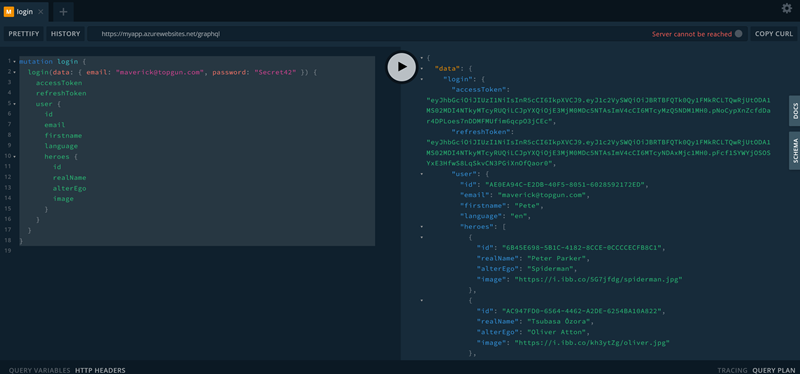
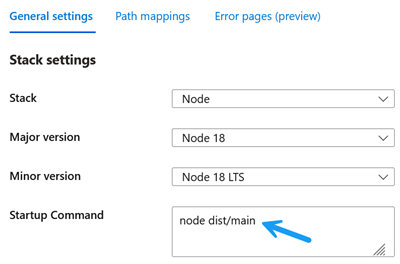
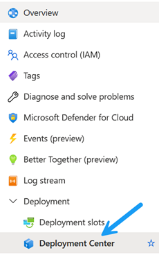
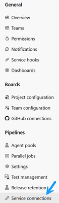
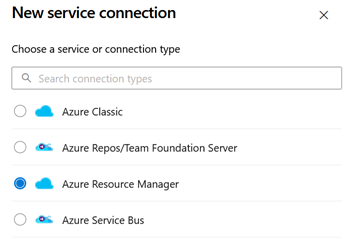
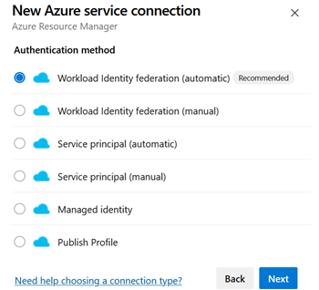
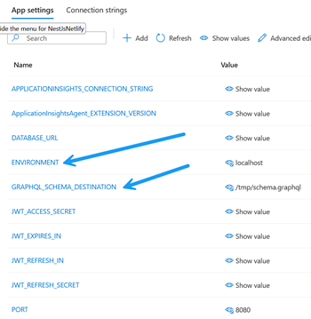

# Deploy Nest JS application to Azure cloud
## Overview
Deploying a NestJS application with Prisma to Azure can be accomplished by following a series of steps. This tutorial will guide you through deploying your application using Azure App Service.

## Prerequisites
1. Node.js and npm: Make sure Node.js and npm are installed on your machine.
1. Azure Account: You need an Azure account. If you don't have one, you can create a free account [here](https://azure.microsoft.com/en-us/free/).

## Step 1: Prepare Your NestJS Application
1. Ensure Your Application is Ready for Deployment:
 - Your NestJS application should be fully developed and tested locally. See original description.
You nees to create postgress database, init it and seed the data
 - Build Your Application:
Run the following command to build your application:
```bash
npm run build
```
 - open browser https:localhost:3000/graphql
 
  ```
 mutation login {
  login(data: { email: "maverick@topgun.com", password: "Secret42" }) {
    accessToken
    refreshToken
    user {
      id
      email
      firstname
      language
      heroes {
        id
        realName
        alterEgo
        image
      }
    }
  }
}
 ```


## Step 2: Set Up Your Azure Environment via Azure Portal
1. Log in to Azure Portal:
Go to the [Azure Portal](https://portal.azure.com/) and log in with your Azure account
2. Create a Resource Group:
 - Navigate to Resource groups on the left sidebar.
 - Click + Create to create a new resource group.
 - Choose a Subscription, and enter a Resource group name (e.g., myResourceGroup).
 - Select a Region close to your users and click Review + Create, then Create.
3. Create an App Service Plan:
 - Go to App Services in the Azure Portal.
 - Click + Create to create a new App Service.
 - Choose your Subscription and Resource Group.
 - Enter a Name for your App Service (e.g., myNestApp).
 - For Publish, select Code.
 - Choose Node.js as the Runtime stack, and select a Version (e.g., Node 18 LTS).
 - Set Region to the same one used for the resource group.
 - For App Service Plan, either create a new one or use an existing one.
 - Click Review + Create and then Create.

  
Where is startup command is very important for application run

## Step 3: Deploy Your Application from Azure Repos

1. Set Up Deployment Center:

 - Once your App Service is created, navigate to your App Service in the Azure Portal.
 - In the left sidebar, click Deployment Center under the Deployment section.
 - In the Source tab, select Azure Repos as the source for your deployment.
 - Authenticate and select the Organization, Project, Repository, and Branch you want to deploy from.
 - The Azure Portal will automatically detect the pipeline YAML file in your repository.
2. Review and Save:
 - Review the detected pipeline configuration. If your YAML file is properly configured, the Azure Portal should recognize it without any issues.
 - Click Save to finalize the deployment setup.
 
**Note:** You need to replace `AlexServiceConnection` with your own service connection. From project settings on azure devops portal
  

## Step  4: Trigger the Deployment
1. Variant 1  - Commit something to the Selected Branch:
 - Any commits or merges to the branch specified in your pipeline YAML (trigger section) will automatically trigger a deployment pipeline in Azure DevOps.
2. Variant 2 - Manually Triggering a Pipeline Run in Azure DevOps
 - Go to the [Azure DevOps portal](https://dev.azure.com/).
 - Navigate to your project where the pipeline is configured.
 - In the left sidebar, click on Pipelines to view all your pipelines.
 - Find the pipeline associated with your NestJS application and click on it.
 - On the pipeline page, you'll see a Run pipeline button at the top right.
 - Click Run pipeline. This will open a window where you can choose the branch, commit, and other settings.
 - You can choose to run the pipeline with the default settings, or customize them as needed.
 - After configuring, click Run to manually start the pipeline.
 
## Step 5: Configure Environment Variables
Set Environment Variables in Azure:
- In the Azure Portal, navigate to your App Service.
- Under Settings, click Configuration.
- In the Application settings tab, click + New application setting.
- Add your environment variables, such as DATABASE_URL  


Click OK, then Save to apply the settings.

## Step 6: Verify the Deployment
Once the deployment is successful, navigate to the Overview section of your App Service in the Azure Portal. Click on the URL provided to access your deployed NestJS application.
Add /graphql as you can see in local deployment.